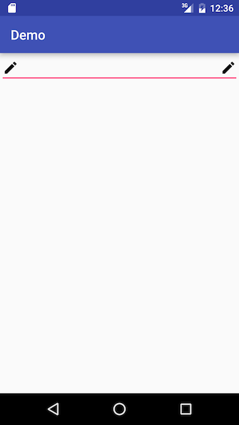

#SimpleEditText

###Install
Add it in your root build.gradle at the end of repositories:
```
allprojects {
	repositories {
		maven { url "https://jitpack.io" }
	}
}
```
Add the dependency
```
dependencies {
	 compile 'com.github.h0lyalg0rithm:simpleedittext:v0.1.1'
}
```

###Usage
To add drawables to the begining or end of the edittext use the app namespace.
```xml
<com.surajms.simpleedittext.SimpleEditText
        android:layout_width="match_parent"
        android:layout_height="wrap_content"
        android:id="@+id/simple_text"
        app:append_icon="@drawable/edit_24dp"
        app:append_icon="@drawable/edit_24dp"/>
```
Add listener to icons
```java
SimpleEditText simpleEditText = (SimpleEditText)findViewById(R.id.simple_text);

simpleEditText.setAppendTouchListener(new SimpleEditText.TouchListener() {
  @Override
  public void onTouch() {
      Toast.makeText(getApplicationContext(), "Test", Toast.LENGTH_SHORT).show();
  }
});
        
simpleEditText.setPrependTouchListener(new SimpleEditText.TouchListener() {
  @Override
  public void onTouch() {
      Toast.makeText(getApplicationContext(), "Test", Toast.LENGTH_SHORT).show();
  }
});
```

####Password Field
```xml
 <com.surajms.simpleedittext.SimplePasswordEditText
        android:layout_width="match_parent"
        android:layout_height="wrap_content"/>
```

